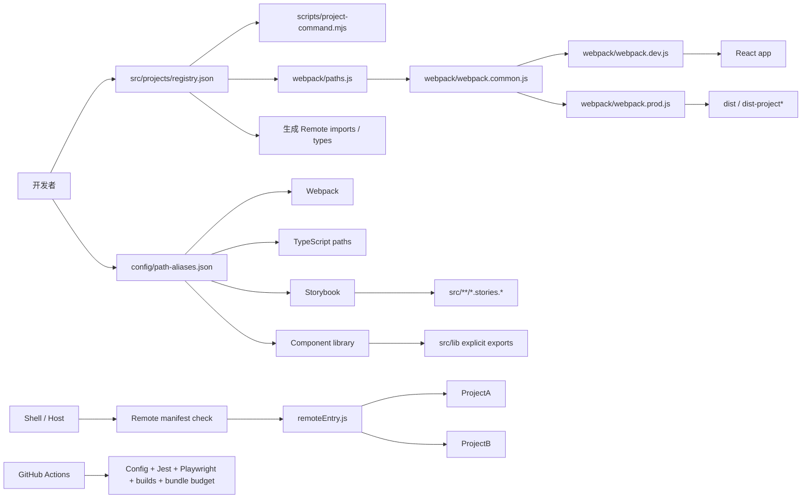

# 技术架构与改进落实

本文按 `webpack` 分支当前代码编写。应用、微前端、组件库和 Storybook 均使用 Webpack；Vite 不在当前构建链路中。下文的“已落实”指仓库代码与 CI 已具备对应约束；线上 Vercel Dashboard 和凭据轮换属于仓库外操作。

## 架构总览



配置入口分成两个单一数据源：

- `src/projects/registry.json`：项目入口、路由目录、产物目录、开发端口、Remote 暴露路径和 MFE 协议版本。
- `config/path-aliases.json`：源码别名。Webpack、Storybook 和组件库直接读取；TypeScript 使用生成的 `tsconfig.paths.json`。

Webpack 的应用、Storybook 和 lib 都基于 Webpack 5，但各自负责不同的产物：应用和 Remote 输出部署站点，Storybook 输出组件文档，lib 输出 ESM/UMD/CJS npm 包。它们共享 alias；样式规则根据产物目的保持独立：应用/lib 提取 CSS，Storybook 在浏览器中注入 CSS。

## 应用启动和路由

1. `scripts/project-command.mjs` 从项目注册表解析项目名、端口、构建角色和 Webpack 配置。旧的 `start:projectA` 等命令作为兼容入口转交给这个脚本。
2. `webpack/paths.js` 验证入口和路由目录，计算 `@app`、`@routers` alias 和产物目录。未知项目立即报错。
3. 主应用或项目入口调用 `src/bootstrap/renderApp.tsx`，创建 React 根节点并安装全局 Provider、错误边界和遥测。
4. `src/theme.tsx` 建立 Hash Router、主题和布局，页面与权限由对应路由模块组合。

Hash Router 将业务地址放在 URL 的 `#` 后面，因此 GitHub Pages 不需要为业务路由额外配置服务器 fallback。

## 多项目与微前端

多项目构建在构建时选择一个项目入口；Module Federation 分别构建 Shell 和 Remote，并在运行时组合。

| 模式 | 选择方式 | 输出 | 主要用途 |
| --- | --- | --- | --- |
| 主应用 | `PROJECT=default` | `dist/` | 主站和 GitHub Pages |
| 独立项目 | `PROJECT=projectA/projectB` | `dist-projectA/`、`dist-projectB/` | 独立运行项目入口 |
| MFE | `MFE_ROLE=host/remote` | `dist-shell/`、`dist-project*/` | Shell 加载远程 App |
| Vercel 聚合部署 | `pnpm run vercel-build` | `dist-vercel/` | Shell 根路径、Remote 子路径 |

Shell 的静态 Remote import 位于生成的 `src/projects/shell/remote-components.tsx`。它和 `typings/module-federation.d.ts` 均由 `src/projects/registry.json` 生成，以满足 Webpack Module Federation 对静态模块名的编译要求。

Remote 构建会生成 `remote-manifest.json`，包含 schema、Remote 名称、应用版本、Git SHA、暴露模块和共享依赖范围。Shell 在插入 `remoteEntry.js` 前检查 schema、名称和 `mfeProtocolVersion`；加载失败后重试一次，总等待时间不超过 15 秒。协议不匹配时进入 Remote 降级面板。

`src/mfe/bridge.ts` 提供同页面事件和共享状态；payload 在运行时校验。协议版本来自项目注册表，并用于区分全局事件总线。`postMessage` 默认只接受同源，跨域接入必须配置准确的 origin。事件桥不是认证边界，不能传递秘密。

### 新增项目或 Remote

1. 在 `src/projects/registry.json` 注册入口、路由、输出和端口；Remote 另设 `mfeExpose`、`devUrl`、`prodPath` 和环境变量键。
2. 运行 `pnpm run sync:project-contracts`，更新静态 Remote imports 和 TS 类型。
3. 运行 `pnpm run check:project-registry`、`pnpm run check:project-contracts`。
4. 在对应项目内实现页面与暴露的 `mfe/App.tsx`。

项目命令由注册表驱动，不需要为新项目复制一整条 Webpack 命令：

```bash
pnpm run project:dev -- projectA
pnpm run project:build -- projectA
```

### 本地联调 MFE

分别启动三个终端：

```bash
pnpm run start:mf:projectA
pnpm run start:mf:projectB
pnpm run start:mf:shell
```

Shell 默认在 8080，Remote 默认在 8081 和 8082。打开 `http://localhost:8080/#/portal`。浏览器先读取 Remote manifest，再加载 Remote entry 和 chunk。

## 别名与工具配置

`config/path-aliases.json` 是路径映射唯一源。修改别名后运行：

```bash
pnpm run sync:aliases
pnpm run check:aliases
```

Webpack 应用会将注册表计算出的 `@app`、`@routers` 覆盖清单默认路径；组件库和 Storybook 使用仓库根路径。优化媒体时，生产配置还可将 `@assets/audio`、`@assets/video` 指向压缩资源目录。新增 alias 不再需要分别修改 Webpack、TypeScript、Storybook 和 lib。

## 目录职责

| 目录 | 职责 |
| --- | --- |
| `config/` | 路径 alias、构建体积预算 |
| `src/projects/registry.json` | 项目入口、输出、Remote URL 和协议清单 |
| `webpack/` | Webpack 应用、MFE、客户端环境变量和组件库构建 |
| `scripts/` | 项目命令、生成契约、配置校验、产物组装和发布辅助 |
| `src/bootstrap/` | 共享 React 启动包装 |
| `src/theme.tsx`、`src/theme/` | Router、主题和布局 |
| `src/routers/`、`src/projects/` | 主应用路由及派生项目入口、页面 |
| `src/pages/`、`src/components/` | 页面和可复用应用组件 |
| `src/service/`、`src/store/` | API 请求、业务服务和状态 |
| `src/mfe/` | Host/Remote 消息桥和共享状态 |
| `src/lib/` | npm 组件库的显式公开 API |
| `.storybook/` | Storybook Webpack builder、preview 和装饰器 |
| `api/` | 本地 Express helper、OAuth、埋点和示例接口 |

## CI 与构建体积

`.github/workflows/webpack-ci.yml` 覆盖：

- 项目注册表、浏览器环境变量 allowlist、共享 alias 和生成契约检查。
- Vercel 配置检查：构建目标、Remote manifest/entry 缓存、CORS 和 hash 资源策略。
- Jest、主应用 Playwright E2E 和 MFE manifest/Remote 加载成功、失败重试 E2E。
- 默认应用 Webpack 生产构建、初始 JS/CSS 预算检查和 stats artifact。
- Storybook 独立静态构建。
- Shell + 全部 Remotes 聚合构建及 `remote-manifest.json` 契约检查。

`config/bundle-budget.json` 使用当前 Webpack 默认的 6 MiB 初始 entrypoint 和单资源上限。每次 CI 会生成 `compilation-stats.json` 并保存 14 天；本地可运行 `pnpm run build:stats` 和 `pnpm run check:bundle-budget` 获取同一种测量。`docs/build-and-bundle-optimizations.md` 中较早的具体大小属于历史快照，不是现行测量结果。

## API、数据和安全边界

`api/server.js` 只用于本地 helper 或经过配置的服务端运行环境。管理接口要求服务端 `TRACKING_ADMIN_TOKEN`；CORS 使用 allowlist，JSON body 上限 1 MB。

- 开发默认使用最多 10000 条的内存 store，collect 每批最多 100 条，并限制单 IP 每分钟 60 个请求。
- 生产默认使用 MongoDB；未配置 `MONGODB_URI` 或数据库无法连接时拒绝启动。
- MongoDB 埋点创建查询索引并在 90 天后 TTL 删除；请求 IP 不写入事件。
- 当前速率限制是单进程保护，多实例滥用防护仍由生产 Gateway/CDN/WAF 提供。

Webpack 浏览器环境值由 `webpack/client-env.js` 白名单注入，敏感变量名会被拒绝。GitHub OAuth secret、Sentry upload token、数据库凭据和管理 token 只能放在服务端环境。Sentry PII 与 Replay 默认关闭。

## 当前不足、建议与落实状态

| 之前识别的不足 | 当前落实 | 状态 |
| --- | --- | --- |
| 项目脚本、Shell imports、Remote 类型重复维护 | 项目命令、静态 imports 和类型从 `src/projects/registry.json` 解析或生成；CI 检查生成文件是否过期 | 已关闭 |
| Webpack、TS、Storybook、lib alias 漂移 | 共用 `config/path-aliases.json`；TS config 自动生成并在 CI 校验 | 已关闭 |
| Remote 缺少可检查的发布契约 | 新增 `remote-manifest.json`，Host 校验协议版本、名称和 schema；构建 CI 校验所有 MFE artifacts | 已关闭 |
| Remote 失败后只有刷新页面 | loader 增加一次自动重试、15 秒总超时，保留明确降级界面 | 已关闭 |
| 埋点只存在内存且可无限提交 | 生产 Mongo 持久化、90 天 TTL、事件批次上限、请求体上限和 per-process rate limit | 已关闭（应用层） |
| CI 只构建默认应用，缺少 Remote 成功/失败验证 | 加入 Jest、主应用和 MFE Playwright、Storybook build、MFE 聚合 build、artifact contract 和 bundle budget | 已关闭（部署后响应头仍需线上核对） |
| Bundle 体积记录已过时 | CI 每次产出 stats artifact，并用 6 MiB Webpack 上限做初始预算门禁 | 已关闭（持续采样） |
| Vercel 各 Remote 的缓存和跨域策略不完整 | 仓库配置补上 Remote manifest/entry no-cache、hash chunk immutable、静态跨域响应头 | 已落实 |
| 凭据可能在 Git 历史中出现 | 当前环境文件和浏览器白名单已清理，服务端边界已明确 | 需要外部轮换 |
| Vercel 面板可能覆盖仓库设置 | 聚合和独立项目配置文件均存在；真实 Git 集成项目仍需按 Preview 核对设置 | 需要线上核对 |

仓库能控制的架构和质量门禁已在代码中实现。还需在对应服务账号中撤销/轮换曾经暴露的 GitHub PAT、OAuth 和 Sentry 凭据，并确认每个 Vercel Project 的 Root Directory、Build Command、Output Directory、环境变量和部署后响应头。上述操作需要服务账号权限，不由本地代码变更代替。
