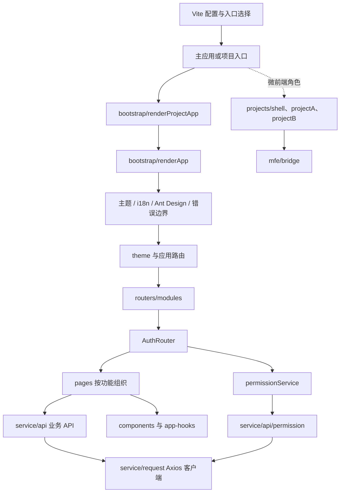

# 技术架构与代码地图

本文描述当前代码的实际边界。新增功能时优先沿用这些边界，避免在页面中直接堆叠路由、请求、权限和通用 UI 逻辑。

## 架构概览

应用、组件库、Storybook 和微前端都使用 Vite。普通应用只选择一个入口；Module Federation 只在微前端角色构建中启用。



## 关键边界

| 目录 | 职责 | 新代码放置建议 |
| --- | --- | --- |
| `src/bootstrap` | React 根节点挂载、全局 Provider 和项目统一启动 | 只放应用启动与装配逻辑 |
| `src/projects` | 默认应用以外的项目入口、路由覆盖和微前端宿主/远程应用 | 项目差异放在对应子目录，通用能力仍放共享目录 |
| `src/routers` | 路由模块、认证守卫、路由归一化和权限元数据 | 新页面路由加入对应 `*.routes.tsx`，不要在页面组件里做路由注册 |
| `src/pages` | 按业务/演示功能组织页面 | 页面负责组合 UI 与状态，不直接实现通用 HTTP 协议 |
| `src/components` | 可复用 UI、业务组件和组件级 Hooks | 通用 UI 放 `stateless`，有业务状态的组件放 `stateful` 或明确的领域目录 |
| `src/app-hooks`、`src/hocs` | 应用级 Hooks、上下文和高阶组件 | 只在逻辑确实横跨多个页面/组件时放到这里 |
| `src/service/api` | 按领域封装后端或第三方 API | 页面调用领域函数，不重复拼 URL、请求参数和传输选项 |
| `src/service` | Axios 请求客户端、认证和权限服务 | HTTP 配置集中在 `request.js`；领域服务通过 `api/` 调用 |
| `src/store` | 跨页面共享的客户端状态 | 仅当状态确实需要跨组件共享时新增 Zustand slice |
| `src/config`, `src/data`, `src/mock` | 配置、静态演示数据和本地模拟数据 | 避免把业务规则散落在页面常量中 |
| `src/lib` | `@w.ui/wui-react` 对外导出入口 | 新增 npm API 时显式更新这里，不以内部 barrel 代替发布 API |
| `src/theme`, `src/styles`, `src/i18n`, `src/locales` | 主题、样式和本地化基础设施 | 全局能力在对应边界内维护 |
| `src/pwa`, `src/utils`, `src/types` | Service Worker 注册、通用函数和共享类型 | 通用工具不应反向依赖页面或项目入口 |

仓库根目录的 `build/` 放 Vite 配置辅助模块，`scripts/` 放构建、验证和维护脚本，`public/` 放不经模块打包的静态文件，`docs/` 放开发与架构说明。

## 启动链路

1. Vite 根据 `PROJECT` 选择应用入口；未设置时使用 `src/index.tsx`。
2. 默认入口注册 Service Worker，再调用 `renderProjectApp`。ProjectA、ProjectB 和 Shell 使用相同的启动封装，只提供各自的标题和 React `identifierPrefix`。
3. `renderProjectApp` 组合主题和水印；`renderApp` 统一挂载错误边界、i18n、Ant Design Provider、断点监听及可选监控。
4. `theme` 进入路由树。`routers/index.tsx` 汇总模块路由、归一化路径并补充权限元数据；`AuthRouter` 负责运行时登录和路由权限判断。
5. 页面调用 `service/api` 中的领域函数；领域 API 使用唯一的 `service/request.js` 客户端。

## 页面、请求和状态的依赖方向

```text
页面 -> 领域 API (service/api) -> request.js -> Axios / 网络
页面 -> 组件 / Hooks -> Zustand（仅跨页面共享状态）
路由守卫 -> permissionService -> 权限 API -> request.js 或 Mock
```

- 请求的 URL、参数、超时、认证和错误提示属于 API/请求层；页面只处理展示状态和用户交互。
- `request.js` 默认从本地存储读取演示 Token，支持取消重复请求、时间戳参数和可选加密。使用外部公开 API 时显式关闭凭证、Token 和加密。
- `permissionService` 管理权限缓存与检查；API 适配和 Mock 数据各自位于 `service/api/permission.ts` 与 `mock/permission.ts`。
- 优先使用组件本地状态。只有多个页面/功能确实共享的状态，才进入 `src/store`。

## 新增功能的推荐流程

1. 在 `src/pages/<feature>/` 创建页面，并把页面专属组件留在该功能目录。
2. 有网络交互时，在 `src/service/api/<domain>.ts` 新增有类型的领域函数，再由页面调用。
3. 在 `src/routers/modules/` 对应路由模块注册懒加载页面；菜单和权限配置沿用现有路由元数据及 `mock/permission.ts` 映射。
4. 可复用组件进入 `src/components/`；只有要从 npm 包公开的组件才进入 `src/lib` 导出入口。
5. 需要跨项目提供功能时，先确认它属于共享基础设施；只对某项目有效的变化留在 `src/projects/<name>`。

## 项目与构建边界

- `src/index.tsx` 是默认应用入口；`src/projects/<name>/index.tsx` 是独立项目入口。
- `PROJECT` 选择入口和项目路由别名。普通多项目模式共享依赖和基础设施，但分别生成产物。
- `MFE_ROLE=host|remote` 才启用 Module Federation；宿主与远程应用分别从 `src/projects/shell`、`src/projects/projectA`、`src/projects/projectB` 构建。
- 构建命令、产物目录与部署平台入口见 [Vite 构建](../build/VITE_BUILD.md)；本地启动见 [本地开发指南](../getting-started/LOCAL_DEVELOPMENT.md)。

